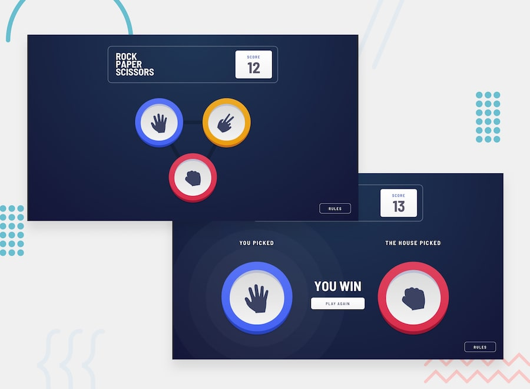

# Component-Based Rock Paper Scissor Game using VueJS

## Project Log
This was another challenge in front-end mentor, at first i wanted to do it with vanilla js!
But then i realised that give me the least reactivity and hell of a spaghetti code.
So i decided to do this with my current knowledge of VueJS and it was an awesome experience.

I've got few issues that need some work:
* Refactor the functions and make it a bit cleaner.
* make the whole thing responsive since for the time being, it's just a desktop version.
* Add some more styling for better visualization.

### Note to myself:
I have to learn vue Style Guide for naming components, folder structures and etc.
I need to find a way to organize my code better than this and also comment much more on the code.